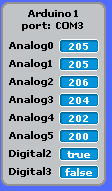
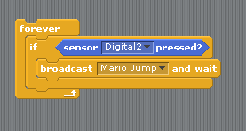
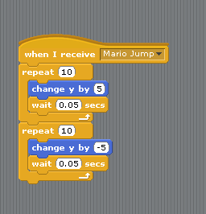
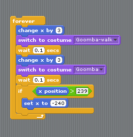
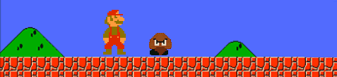
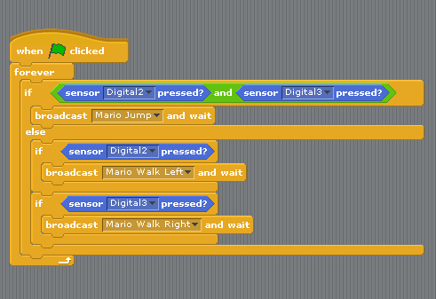
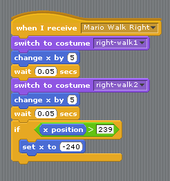

# Build a Mario Game Controller
In this lab we will build a game controller for a Mario game. Since this is a large project, we'll complete it in four stages:
1. Build a circuit with one button and make Mario jump when that button is pressed
2. Add one more button and code so that both Goomba dn Mario can walk
3. Write code so that if Mario jumps on top of Goomba, then Goomba is "squished"
4. Write code so that if Goomba touches Mario when Mario is on the ground the game ends

### Step 1: Build a circuit with one button that can make Mario jump
Our Game Controller will use the following parts:
- Two push buttons
- Two 10KΩ resistors
- Jumper wires   

Use the picture below to make sure you are using correct 10KΩ resistor.   
   
   
Use the following circuit diagram to construct a circuit with one push button. The direction of the 10KΩ resistor is unimportant.   

### Step 2: Test the circuit
Test the circuit by checking that *Digital 2* changes to *true* when you press the button.   

### Step 3: Download the artwork and sounds for the Mario game and open it in S4A
Ask your instructor for the `MarioBase.sb` file. Copy the `MarioBase.sb` file to your *Scratch Projects* folder in your *My Documents* folder. Open the S4a program and then choose *File | Open* and browse to and select `MarioBase.sb`.

### Step 4: Write code to make Mario jump
In the Arduino sprite, create a forever block that checks if the button is pressed. If it is, broadcast a message like "Mario Jump".   
   
In the Mario sprite, add a *When I receive* block that makes Mario jump. You should have Mario switch costumes to make a more realistic jump. One way of making Mario jump is shown below.    
   

### Step 5: Write code to make Goomba walk
To create an animation of walking, switch back and forth between the two walking costumes. Goomba should "wrap" around the screen, when  Goomba goes off one side of the screen, Goomba should then appear on the other side. Use *wait* to pause Goomba after each step. Adjust the values until you are happy with Goomba's walk. See the sample code below for an example.   
   
   

### Step 6: Add one more button and code to make Mario walk left or right
Add a second button to your circuit and connect it *Digital 3* with another 10KΩ resistor and jumper wires just like you did with the first button. In the Arduino sprite, add code to check to see if one or both of the buttons is pressed.  Add two new broadcasts for walking left and right.   
    
In the Mario sprite, add two *When I receive* blocks to check for the new broadcasts. Below is a one possible block arrangement.   
    

### Step 7: Add the Goomba "squish"
Now we are going to add code to the Goomba sprite in our Mario program so that if Mario is jumping and he lands on the Goomba, the Goomba will squish. Add a forever loop to the Goomba sprite and:
 * create an if statement that checks to see if the Goomba is touching Mario and Mario's y position is greater than -110. If that is true:
    * set the Goomba's y to -140
    * switch the Goomba's costume to squish,
    * have the Goomba think "Hmm" for 2 seconds 
    * change the costume and y back to what they were
 * Include a wait in the forever loop so that the if statement is checked every .1 seconds.
You may find the blocks in the attached picture useful in solving this problem. To test your code, just click and drag Mario on top of the Goomba.      

### Step 8: Ending the game
Create a forever block for the Mario sprite to check if he touches Goomba when he is on the ground
If he does, have him change his y coordinate to -115 and point him in the 0 direction (up)
You can test your program by dragging Mario with the mouse. If Mario is in the air, the goomba should squish, but if Mario is on the ground he should die

### Step 9: Submit your finished program
The steps listed above are just suggestions to get you started. Your Mario game doesn't have to work or look like any other. Have fun and be creative. When you are finished, have your teacher or a TA verify that you have a working program. Submit your finished program by uploading the .sb file to Google classroom. You should be able to find it in *My Documents | Scratch Projects*. If you worked with a partner, each partner should submit a copy of the finished program to Google classroom.
